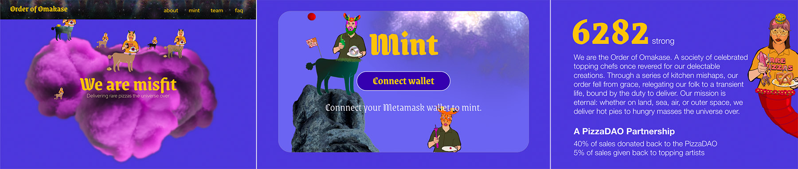

# Order of Omakase
## Frontend dApp for Omakase NFT

Scheduled to launch summer of 2022, Order of Omakase is a set of unique characters built from artwork contributed by members of PizzaDAO.

This is the frontend React site for minting. This version is built in a Docker container with a service for retrieving signed messages for pre-sale verification. Signed messages are created using wallet addresses on the pre-sale allow list, then validated using ECDSA.sol on the contract side. 

## Features

- React app with web3 integration for minting
- Python FastAPI service for serving signatures to client

## Tech

Technologies involved:
- [React] - Your basic React SPA
- [FastAPI] - Backend service using python and FastAPI to serve signatures
- [NGINX] - Expose both the site and the api using nginx
- [Docker] - Docker compose used to package it all up for deployment